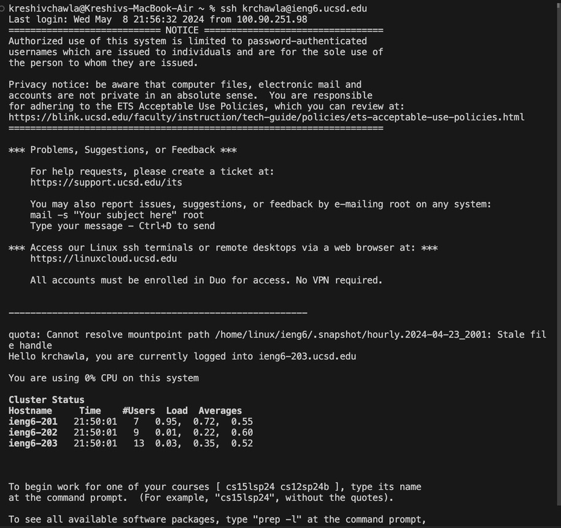
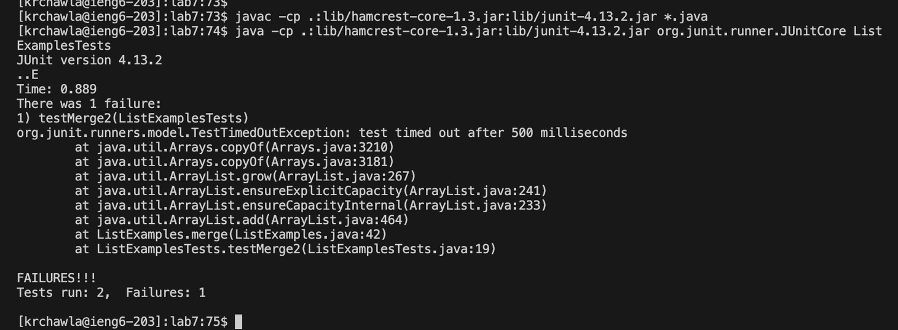

# lab-rep4

logged into the ieng6 server :

<bl/>

I then cloned the github path.

TESTS:
<bl/>

compiled and ran tests using javac and java commands.

EDITING CODE USING VIM:
<bl/>

Openecd the file to edit using `vim`. keys pressed: vim `<space> `ListExamples.java` <enter>`

CHANGES MADE:
 <bl/>

`<down>` key approximately 43 times to reach the line with the bug in it. then` <right>` key around 12 times to reach the last character of "index1". then changed it to "index2"
then pressed `<esc> <wq> <enter>`. changes saved.

<bl/>

RUNNING TESTS AGAIN:

<bl/>

using bash test.sh to run tests again.

COMMIT:

<bl/>
i then used ` git init` to reinitiate the existing repository.
i then added the ListExamples java file to the repository using the  `git add ListExamples.java` 
and then  used `git commit -m "TestMerge2 fixed"` to commit the changes made
finally used `git push origin main` to push the changes to the main branch

