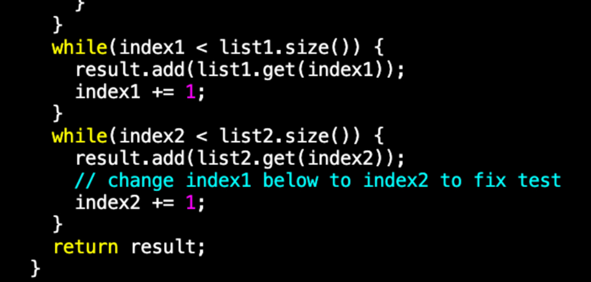
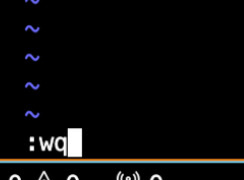

# lab-rep4

logged into the ieng6 server :

I then cloned the github path.

TESTS:

compiled and ran tests using javac and java commands.

EDITING CODE USING VIM:

opened the file vim. key pressed: vim `<space>` ListExamples.java `<enter>`

CHANGES MADE:

`<down>` key approximately 43 times to reach the line. then` <right>` key around 12 times to reach the last character of "index1".
then pressed `<esc wq>`` <enter>`. changes saved.

RUNNING TESTS AGAIN:

using bash test.sh to run tests again.

COMMIT:

